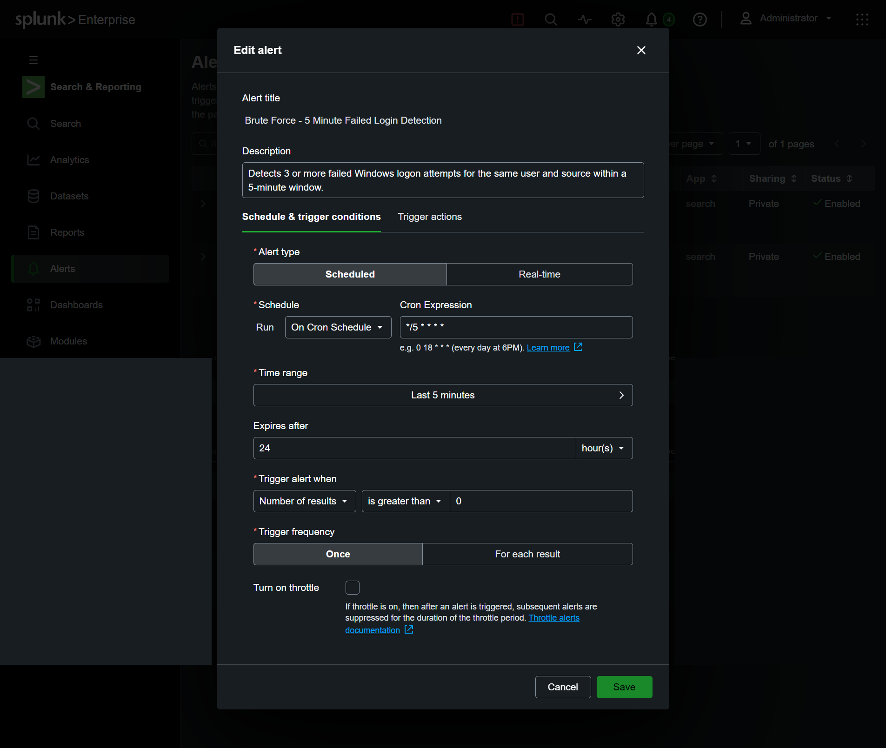
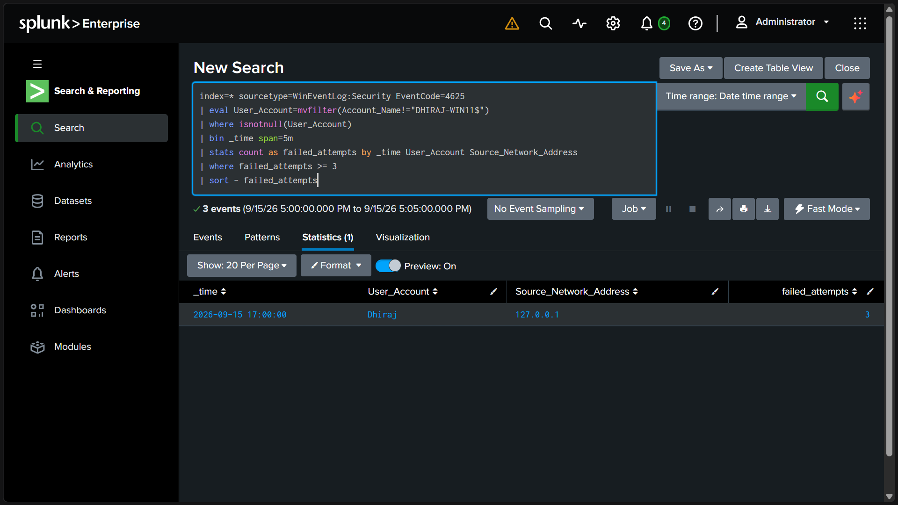
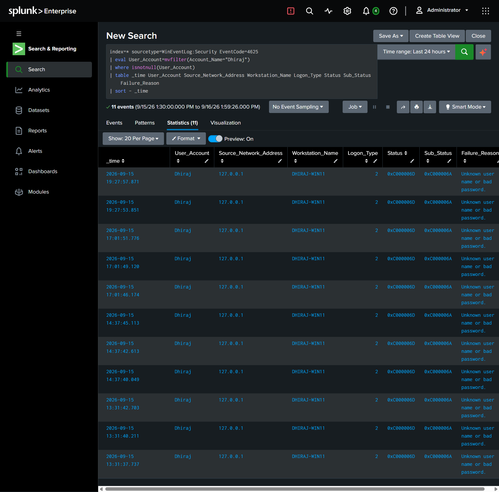
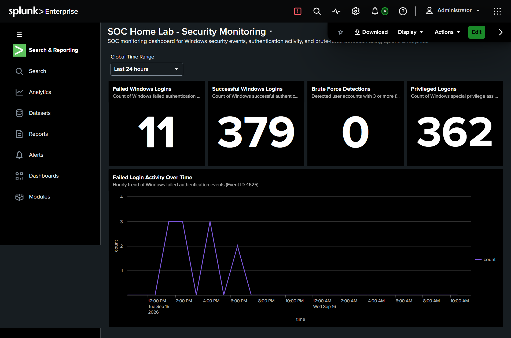
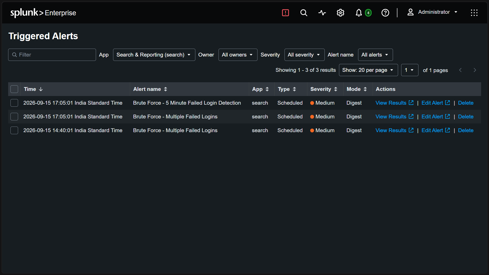

# 🛡️ SOC Home Lab – Windows Security Monitoring & Brute-Force Detection

## 📌 Project Overview

Built a hands-on Security Operations Center (SOC) home lab using Splunk Enterprise to collect, monitor, investigate, and detect Windows authentication activity.

The project demonstrates an end-to-end SOC workflow:

**Windows Security Logs → SIEM → Detection Engineering → Alerting → Investigation → MITRE ATT&CK Mapping → Response**

---

## 🎯 Objectives

- Collect Windows Security Event Logs in Splunk
- Monitor authentication activity
- Investigate failed and successful logons
- Develop a brute-force detection rule
- Configure a scheduled security alert
- Validate the detection using controlled lab activity
- Map the detected behavior to MITRE ATT&CK
- Document investigation findings and response recommendations

---

## 🛠️ Technologies & Tools

- **Splunk Enterprise 10.4.3**
- **Windows 11**
- **Windows Event Logs**
- **SPL (Splunk Search Processing Language)**
- **VMware**
- **MITRE ATT&CK**

---

## 🔎 Windows Events Investigated

| Event ID | Description |
|----------|-------------|
| 4624 | Successful Logon |
| 4625 | Failed Logon |
| 4672 | Special Privileges Assigned to New Logon |

---

# 🚨 Detection Engineering

## Detection Objective

Detect **3 or more failed Windows logon attempts for the same user and source within a 5-minute window**.

## SPL Detection

```spl
index=* sourcetype=WinEventLog:Security EventCode=4625
| eval User_Account=mvfilter(Account_Name!="DHIRAJ-WIN11$")
| where isnotnull(User_Account)
| bin _time span=5m
| stats count as failed_attempts by _time User_Account Source_Network_Address
| where failed_attempts >= 3
| sort - failed_attempts
```

## Detection Logic

The detection performs the following steps:

1. Filters Windows failed authentication events using Event ID **4625**
2. Extracts the user account
3. Groups events into **5-minute windows**
4. Groups activity by user and source network address
5. Counts failed authentication attempts
6. Returns a detection when the number of attempts is **3 or greater**

---

# 🔔 Alert Configuration

A scheduled Splunk alert was configured to operationalize the detection.

### Alert Details

| Configuration | Value |
|---------------|-------|
| Alert Name | Brute Force - 5 Minute Failed Login Detection |
| Alert Type | Scheduled |
| Schedule | Every 5 minutes |
| Time Range | Last 5 minutes |
| Trigger Condition | Number of Results > 0 |
| Trigger | Once |
| Severity | Medium |
| Action | Add to Triggered Alerts |
| Permissions | Private |

### Alert Configuration Evidence



---

# 🧪 Detection Validation

The detection was validated using controlled Windows authentication testing.

Three incorrect passwords were intentionally entered for the test account.

Splunk successfully detected the authentication activity.

### Detection Result

| Field | Result |
|-------|--------|
| User Account | Dhiraj |
| Source Address | 127.0.0.1 |
| Failed Attempts | 3 |
| Detection Window | 5 minutes |
| Event ID | 4625 |
| Logon Type | 2 |

### Detection Result Evidence



The scheduled Splunk alert successfully appeared in **Triggered Alerts**.

---

# 🔎 Incident Investigation

## Observed Activity

The failed authentication events contained the following characteristics:

- **Event ID:** 4625
- **User Account:** Dhiraj
- **Source Address:** 127.0.0.1
- **Logon Type:** 2 – Interactive
- **Status:** `0xC000006D`
- **Sub-Status:** `0xC000006A`
- **Failure Reason:** Unknown user name or bad password
- **Attempts:** 3 within a 5-minute window

### Failed Login Investigation Evidence



## Source Analysis

The source address was:

`127.0.0.1`

This is the localhost address of the system.

Therefore, the observed activity did not provide evidence of an external source in this controlled test.

## Timeline

During detection validation, three failed authentication attempts occurred within the same 5-minute detection window.

Splunk grouped the events and produced the following detection:

```text
User Account: Dhiraj
Source: 127.0.0.1
Failed Attempts: 3
Detection Window: 5 minutes
```

---

# 🧑‍💻 Analyst Assessment

The observed authentication pattern is consistent with password-guessing behavior because multiple failed authentication attempts occurred for the same account within a short time window.

However, the activity originated from **127.0.0.1 (localhost)** and was intentionally generated as part of a controlled SOC laboratory test.

### Final Classification

**Controlled Lab Test — No Confirmed Malicious Activity**

No confirmed external attack or account compromise was identified from this test.

---

# 🎯 MITRE ATT&CK Mapping

### Tactic

**Credential Access**

### Technique

**T1110 – Brute Force**

### Sub-technique

**T1110.001 – Password Guessing**

The repeated failed authentication pattern observed during the controlled test is consistent with password-guessing behavior.

---

# 🛡️ Recommended SOC Response

If similar activity were detected in a production environment, a SOC analyst could:

1. Validate whether the authentication attempts were authorized.
2. Review successful logon events following the failed attempts.
3. Investigate the source IP address and affected account.
4. Check for additional authentication anomalies.
5. Review related Windows Security events.
6. If malicious activity is confirmed, consider temporarily locking or disabling the affected account.
7. Continue monitoring the account and source for additional suspicious activity.

---

# 📊 Splunk Dashboard

A Splunk Dashboard Studio dashboard was created for security monitoring.

### Dashboard Name

**SOC Home Lab - Security Monitoring**

### Dashboard Panels

- Failed Windows Logins
- Successful Windows Logins
- Brute-Force Detections
- Privileged Logons
- Failed Login Activity Over Time

### Dashboard Evidence



The dashboard provides a centralized view of Windows authentication activity and detection results.

---

# 📸 Project Evidence

The project was validated using screenshots captured from the Splunk environment.

### Evidence 1 — Splunk Security Dashboard

The dashboard provides centralized visibility into Windows authentication activity.


### Evidence 2 — Failed Login Investigation

Shows investigation of Event ID 4625 and authentication-related fields.


### Evidence 3 — Brute-Force Detection Result

Shows the detection identifying 3 failed login attempts for the same user and source within a 5-minute window.


### Evidence 4 — Alert Configuration

Shows the scheduled brute-force detection alert configuration.


### Evidence 5 — Triggered Alert

Shows the Splunk alert successfully triggering after the controlled test.



---

# 🔄 SOC Workflow

```text
Windows Authentication Activity
            ↓
Windows Event ID 4625
            ↓
Splunk SIEM
            ↓
Detection Rule
            ↓
3+ Failed Logins / 5 Minutes
            ↓
Scheduled Alert
            ↓
Alert Triggered
            ↓
Investigation
            ↓
MITRE ATT&CK Mapping
            ↓
Analyst Assessment
            ↓
Recommended Response
```

---

# 📚 Skills Demonstrated

- SIEM
- Security Monitoring
- Windows Event Log Analysis
- SPL
- Detection Engineering
- Alert Triage
- Authentication Monitoring
- Incident Investigation
- Source/IP Analysis
- MITRE ATT&CK
- Security Alerting
- SOC Workflow
- Incident Documentation

---

# 💡 Key Learning Outcomes

Through this project, I practiced:

- Collecting and analyzing Windows Security logs
- Understanding Windows authentication Event IDs
- Writing SPL detection logic
- Creating time-based detection rules
- Configuring scheduled security alerts
- Validating detections using controlled test activity
- Investigating authentication failures
- Mapping observed behavior to MITRE ATT&CK
- Documenting findings using a SOC investigation workflow

---

# ⚠️ Lab Disclaimer

All authentication failures in this project were intentionally generated in a controlled home-lab environment for cybersecurity learning and detection validation.

The observed activity should not be interpreted as a confirmed real-world attack.

---

# 🚀 Project Status

**Completed ✅**

### Completed Components

- [x] Windows Security Log Collection
- [x] Authentication Event Analysis
- [x] Splunk SIEM Configuration
- [x] Detection Engineering
- [x] Splunk Dashboard
- [x] Scheduled Alert
- [x] Alert Trigger Validation
- [x] Incident Investigation
- [x] MITRE ATT&CK Mapping
- [x] SOC Response Recommendations
- [x] Project Documentation
- [x] Evidence Screenshots
